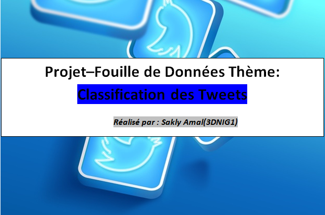

# Notre projet vise à maitriser l’API de twitter pour l’extraction des tweets ainsi que le NLP(naturallanguageprocessing)avec NLTK en Python,aussi mettre en évidence et appliquer
# les principes de nettoyage des données et regrouper ensemble les tweets qui sont similaire.

 
